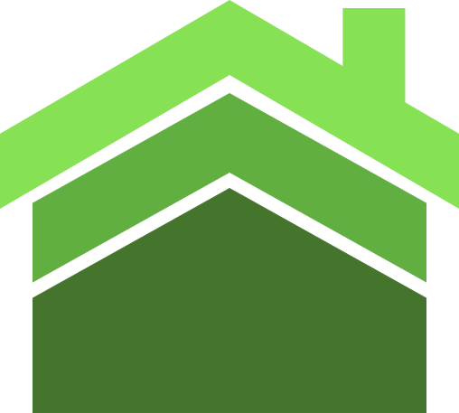

&nbsp;&nbsp;&nbsp;&nbsp;&nbsp;&nbsp;&nbsp;&nbsp;&nbsp;&nbsp;&nbsp;&nbsp;&nbsp;&nbsp;&nbsp;&nbsp;&nbsp;&nbsp;&nbsp;

# HealthyHome

## Overview

HealthyHome is an open-source smart home device which monitors the indoors environment conditions, based on a Raspberry Pi.

## Project Structure

The project is made up of several software components that are placed in the repository in the following structure:

-   `monitoring-server/`: the monitoring server that collects and processes all the data from the server
-   `logging-server/`: the data logging server which keeps track of the realtime data using a document store and builds statistics
-   `mobile-app/`: a mobile application for phones which interfaces the users with the smart device

## Contributing

Please follow the guidelines in the [CONTRIBUTING.md](CONTRIBUTING.md) for any contribution.
